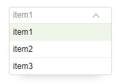

# Selector


-----
hover

------
selected option

---
disabled


## Installation

```shell
npm install roliauo/react-selectjs
```
## Importing

```js
import Selector from 'react-selectjs';
```

## Props

<ul>
 <li>title  (String)</li>
 <li>name (groupName)</li>
 <li>optionList (Array)</li>
 <li>padding (String)</li>
 <li>width (String)</li>
 <li>borderRadius (String)</li>
 <li>onClick (function)</li>
 <li>disabled (string)</li>
 <li>selected (string, optionName)</li>
</ul>

### DefaultProps

    name: 'options'
	optionList: ['item1','item2','item3']
	title: 'Choose...'
	borderRadius: 6px
	width: 150px

## Usage

```js
<Selector disabled="true"
		  selected='item2'
		  padding='5px'
		  borderRadius = '15px'
		  onClick={(e)=> this.setSelectValue(e) } />
```